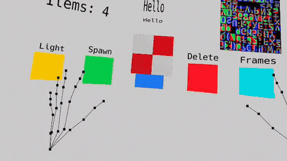

# Manas

A spatial mathematical instrument — a browser-native, hand-tracked AR engine written in PureScript, rendering through raw WebGL2 and running on WebXR.

No Unity. No three.js. No runtime dependencies. About 2,300 lines of PureScript over 270 lines of hand-written JavaScript FFI, talking directly to the GPU and the headset.



> The recording is from a later local build than what is currently in `main` — it shows spheres, cones and cylinders, and a five-item menu. What `main` builds today is described honestly under [What works today](#what-works-today); the extra primitives are on the [roadmap](#roadmap).

## Why this exists

Most spatial computing is built on engines that already decided what a scene is, what an object is, and how you touch it. Manas starts lower down: hand joints arrive from WebXR as raw poses, geometry goes to the GPU as buffers you configured yourself, and every abstraction between those two points had to earn its existence.

The engine is the visible half. The other half is a method — abstractions are grown from working code rather than designed up front, and the type system is held to the standard that **a signature must not lie about what a function does**. The [Architecture](#architecture) section is not decoration; it is the actual working discipline, and the code is small enough that you can check it against the claims.

## What works today

Everything below is implemented in `main` and running on device.

**Hand tracking**
- 25 joints per hand, both hands, from the WebXR `hand-tracking` feature
- Joints drawn as points; 24 bones drawn as a line skeleton
- Joint buffers updated in place each frame (`DYNAMIC_DRAW`), no per-frame allocation

**Interaction**
- **Pinch** — detected when thumb tip and index tip come within 2 cm. The pinch point is the *midpoint* of the two tips, which barely moves as the fingers close, so grabbing does not jerk the object.
- **Spawn** — pinch in empty space to create a cube at your fingertips
- **One-hand manipulate** — grab and translate, preserving the offset at which you grabbed
- **Two-hand manipulate** — grab one object with both hands to translate (midpoint delta), scale (distance ratio) and rotate (axis-angle from the change in the line between your hands) at once
- **Selection** is proximity-based: nearest object whose centre is within a grab radius scaled by the object's own size
- **Hover feedback** — a yellow wireframe overlay appears on any object your hand is near, drawn with depth testing off so it reads on top of the surface

**Rendering**
- Single WebGL2 program, stereo, one draw pass per eye
- Up to 8 point lights, accumulated in the fragment shader: Lambert diffuse with inverse-square distance falloff over a 0.2 ambient floor
- Emissive objects, which bypass lighting and act as light sources for everything else
- MSDF text rendering from a signed-distance font atlas — text stays crisp at any distance
- Spherical billboarding, so labels and menu items turn to face your head in full 3D
- One 2×2 procedural checker texture, applied to all non-text geometry

**In-world UI**
- A three-item menu — `Light`, `Spawn`, `Clear` — built from the same primitives as everything else: each button is an emissive cube with an MSDF label above it, and pressing one is just a pinch landing on an object that happens to carry an action

### Not yet true

Stated plainly, so nothing here oversells:

- **Textures are one procedural checker.** Image loading and `makeTextureFromImage` exist and work, but are used only for the font atlas.
- **Lighting is diffuse only** — no specular, no Phong highlight, no shadows. An object between a light and a surface does not occlude it.
- **Hands only.** `ControllerInput` types exist but are never populated; there is no gamepad path.

## Requirements

- A WebXR device supporting `immersive-ar` **and** the `hand-tracking` feature. Developed and tested on Meta Quest.
- Node.js 18+ (for the build and the dev server)
- `openssl` on PATH (macOS and most Linux ship it) — used to generate the local dev certificate

WebXR is only available over HTTPS, which is why the project ships its own TLS dev server rather than relying on `python -m http.server`.

## Quick start

```bash
git clone https://github.com/albertwilliamsxyz/manas.git
cd manas
npm install
npm run build
npm run serve:https
```

`npm install` pulls in the PureScript compiler and Spago as local dev dependencies, so there is no separate toolchain to set up. `npm run build` compiles PureScript and bundles it to `dist/main.js`. To type-check without bundling:

```bash
npx spago build
```

## Running it on a headset

1. Put the headset and the computer on the same Wi-Fi network.
2. Run `npm run serve:https`. It prints the address it is serving on:

   ```
     Local:   https://localhost:3443
     Network: https://192.168.x.x:3443
   ```

   The LAN address is detected at startup and baked into the self-signed certificate.
3. Open that **Network** address in the headset's browser.
4. The certificate is self-signed, so the browser will warn once: **Advanced → Proceed**.
5. Tap **Start Experience**, then allow the AR and hand-tracking permission prompt.
6. Put your hands up. You should see the joint skeletons and the menu.

Rebuilding is `npm run build` in a second terminal, then reload the page in the headset — the server does not need restarting.

If you want to lose the certificate warning entirely, `serve-https.mjs` ends with instructions for installing an `mkcert` root CA onto the Quest.

## Architecture

Four principles, applied consistently. They are the reason the codebase stays legible without a framework holding it up.

### Progressive crystallization

Abstractions emerge through layers, never top-down:

1. All new functionality starts in `Main`
2. Comment potential patterns to mark them
3. Update naming to reflect emerging concepts
4. Define types when the concept is clear
5. Extract functions when a pattern repeats 3–4 times
6. Extract modules when a group of functions has a clear identity

`Main.purs` is deliberately the largest file. It is the workspace where behaviour lives *before* anyone knows what shape it wants to be. Every module outside it — `Math.Vec3`, `Math.Mat4`, `Math.Geometry`, `Primitives`, `Text.Atlas`, `Text.Layout` — got there by surviving this process, not by being planned.

### Parse, don't validate

Validation happens at system boundaries — FFI, XR frames, WebGL. Domain types are constructed *at* that boundary. Once constructed, the type carries the guarantee, so internal operations are total and their signatures stay simple. No defensive checks inside pure operations on domain types.

In practice: `makeShader` returns `ExceptT String m Shader`, so a `Shader` value is proof that compilation succeeded. Nothing downstream re-checks it.

### Dependencies flow downward

Layers depend only on layers below them, never above. Linear algebra is foundational and reachable by everything. Each pipeline layer consumes one type and produces another.

This is what makes the renderer replaceable: the interaction logic in `updateInteraction` is pure, knows nothing about WebGL, and would work unchanged against WebGPU or no renderer at all.

### Type honesty

Types should reflect what functions actually accept and return — `sub :: Vec3 -> Vec3 -> Vec3`, not `Float32Array -> Float32Array -> Float32Array`. When a type is honest the name gets simpler, because the name stops compensating for what the type failed to say.

The naming vocabulary that falls out of this: `toX`/`fromX` for identity-preserving conversion, `interpretX` for crossing between abstraction levels, `makeX` for construction, `withX` for context-preserving transformation, `xOf` for extraction. Names are meant to read as sentences at the call site:

```purescript
cubeGPUHandle <- uploadGeometry webGL2Context attribLocations cubeGeometry
```

## Project structure

```
src/
  Main.purs              Entry point, render loop, interaction, and every
                         pattern that has not yet crystallized

  Math/
    Vec3.purs + .js      Vector operations
    Mat4.purs + .js      Matrix operations, transforms, basis construction
    Geometry.purs + .js  Ray-triangle intersection (Möller-Trumbore)

  Primitives.purs + .js  Typed-array machinery: get, set, copyInto, conversions

  WebGL2.purs            Idiomatic layer: makeShader, makeProgram, makeTexture...
  WebGL2/Raw.purs + .js  Flat FFI binding, 1:1 with the WebGL2 API

  WebXR.purs             Idiomatic layer: Promise to Aff, Nullable to Maybe
  WebXR/Raw.purs + .js   Flat FFI binding, 1:1 with the WebXR API

  Text/
    Atlas.purs + .js     MSDF font atlas loading and glyph metrics
    Layout.purs          String to positioned quads

  Image.purs + .js       Image loading as Aff

assets/                  Font atlas (MSDF PNG + JSON metrics), demo GIF
notes/                   Working notes on the mathematics (in Spanish)
serve-https.mjs          HTTPS dev server with self-signed cert generation
```

Every FFI module has two sub-layers: a flat raw binding that mirrors the JavaScript API exactly, and an idiomatic PureScript layer above it that returns `Maybe` instead of `Nullable` and `Aff` instead of `Promise`. The raw layer is allowed to be ugly, because it is a transcription. The layer above it is not.

## Roadmap

Tracked in detail in [TODO.md](TODO.md). The near-term direction:

- Separate `WorldState` (pure, portable) from `RenderState` (GPU-specific), so the world can be projected through WebGL2, WebGPU, or nothing
- A `RenderCommand` pipeline — decide what to draw as pure data, then execute it
- Controllers alongside hands, unified behind abstract gesture *intent* rather than mechanism
- Quaternion rotations in the domain `Transform`, converted to matrices at the render boundary
- A scene graph, with transforms composed rather than propagated
- A CAD construction loop: vertex, edge, face, lock into a composition

## License

[MIT](LICENSE) © 2026 Albert Williams
